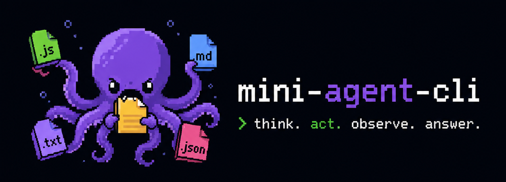
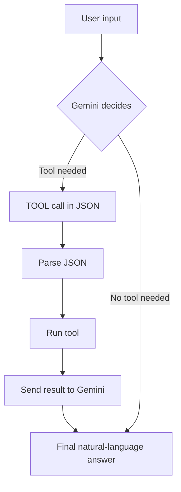

# Mini Agent CLI

<p align="center">
  
</p>

A lightweight CLI AI agent that can read files, write files, list directories and run commands — powered by **Google Gemini** via a simple tool-calling loop.

Built as a hands-on practice project for understanding how AI agents work under the hood.

---

## Features

- Interactive CLI chat loop with **colored output**
- Tool-calling system (read, write, list files, run commands)
- Agent reasoning display — shows _why_ a tool was chosen
- Multi-turn conversation with tool result injection
- Powered by `gemini-2.5-flash`

---

## Project Structure

```
mini-agent-cli/
├── src/
│   ├── agent.js       # Core agent loop (JSON tool detection + LLM calls)
│   ├── llm.js         # Gemini API wrapper
│   ├── tools.js       # Tool registry (metadata + functions)
│   ├── functions.js   # Actual tool implementations (fs operations)
│   └── index.js       # CLI entry point (colored readline interface)
├── .env.example       # Environment variable template
├── CHANGELOG.md
└── package.json
```

---

## Getting Started

### 1. Clone the repo

```bash
git clone https://github.com/HoussemEddineChaouch/mini-agent-cli.git
cd mini-agent-cli
```

### 2. Install dependencies

```bash
npm install
```

### 3. Set up environment variables

```bash
cp .env.example .env
```

Then open `.env` and add your Gemini API key:

```
GEMINI_API_KEY=your_api_key_here
```

> Get a free key at [https://aistudio.google.com/app/apikey](https://aistudio.google.com/app/apikey)

### 4. Run the agent

```bash
node src/index.js
```

---

## How It Works

1. User types a message in the CLI
2. The agent sends it to Gemini with a system prompt listing available tools
   If Gemini decides a tool is needed, it responds with a JSON tool call:

```
TOOL {"name":"listDir","args":{"path":"."}}-{"Reason":"user wants folder content."}
```

4. The agent parses the JSON, logs the **reason** and **chosen tool**, executes it, and sends the result back to Gemini
5. Gemini returns a final natural-language answer



---

**Colored CLI output:**

| Color     | Meaning                                   |
| --------- | ----------------------------------------- |
| 🔴 Red    | Your input prompt (`You >`)               |
| 🔵 Blue   | Agent response (`Agent >`)                |
| 🟡 Yellow | Chosen tool name                          |
| 🟢 Green  | Agent reasoning (why it picked that tool) |

## Available Tools

| Tool        | Description                            |
| ----------- | -------------------------------------- |
| `readFile`  | Reads the contents of a file from disk |
| `writeFile` | Writes or overwrites a file on disk    |
| `deleteFile`| Deletes a file from disk               |
| `listDir`   | Lists all files in a directory         |
| `fetchURL`  | Fetches the content of a URL and returns it as plain text |
| `runCommand`| Executes a shell command and returns the output |
---

## Dependencies

| Package         | Purpose                                |
| --------------- | -------------------------------------- |
| `@google/genai` | Google Gemini API client               |
| `dotenv`        | Load environment variables from `.env` |
| `html-to-text`  | Convert HTML responses to plain text   |

---

## Contributing

Contributions, ideas, and bug reports are welcome! See [CONTRIBUTING.md](.github/CONTRIBUTING.md) for guidelines.

## Contributors

Thanks to everyone who has contributed to this project 🙌

<a href="https://github.com/HoussemEddineChaouch/mini-agent-cli/graphs/contributors">
  
</a>

---

## License

MIT — see [LICENSE](LICENSE) for details.
